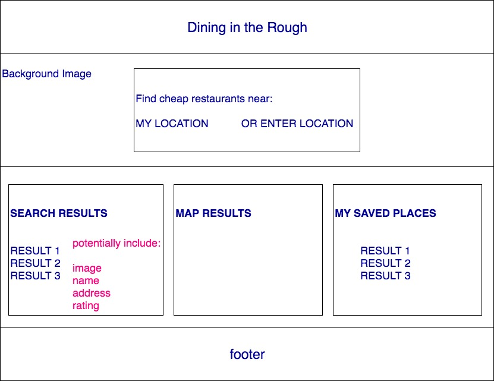
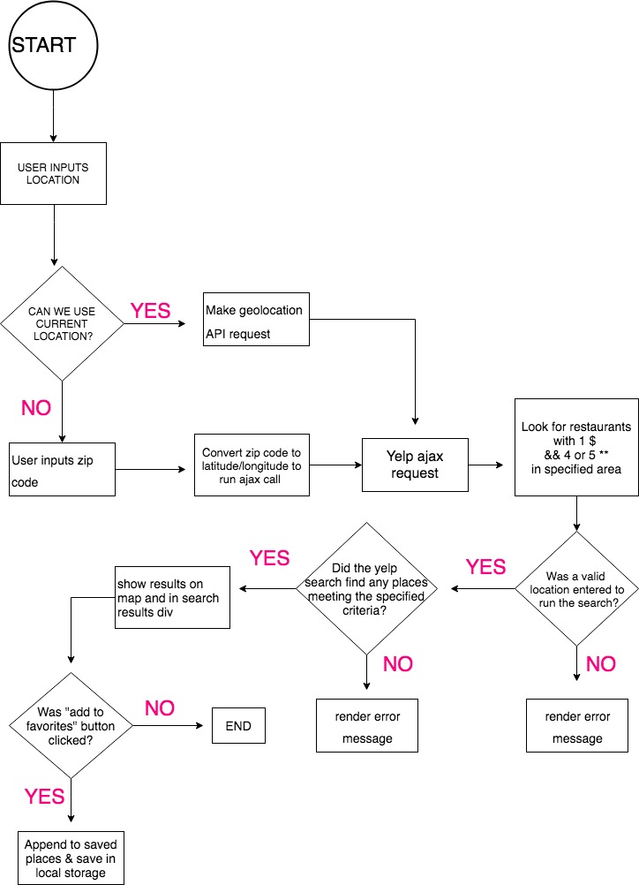

# Dining-in-the-Rough
The Vast Guinea Pigs Corporation created a new web application, designed to help people efficiently find places to eat that are both inexpensive, yet highly rated, using Yelp and Google Map APIs.

## Purpose
We wanted to create an application that would enable users to immediately filter out restaurants that were costly, not highly reviewed, or far away from them. This app enables you to quickly find 10 places that meet these criteria.

## Getting Started
To run the code, download the repository zip file. Then run index.html in your browser.

## Code Style
Our code uses JSdoc style commenting.

## Style Guide
Please review our [styleGuide.md](STYLEGUIDE.md) for details on our chosen fonts and color scheme.

## Built With
* [Bootstrap V3](http://bootstrapdocs.com/v3.0.3/docs/) - CSS framework
* [Yelp Fusion API](https://www.yelp.com/fusion/) - Yelp FUSION API - used to get restaurant information
* [Google MAP API](https://developers.google.com/maps/) - Google MAP API - used for displaying user location and restaurant locations
* [jQuery](http://api.jquery.com/)

## Images
You can view our initial wireframe and logic flowchart below.
 

## Features
* The app enables you to add and remove your favorite restaurant list that is saved in local storage, so that when closing your browser, you can still access your list.
* Results are rendered in a list and map format.
* The site is mobile responsive.

## Future Ideas
Future enhancements to the site could include:
* Showing recommended food items within the restaurant results based on the most mentioned/highly reviewed menu items.
* Displaying only restaurants that are open at the time of searching to the user.
* Adding a search query option for specific food items (i.e. searching for "pizza") and rendering restaurants that serve that food.

## Collaboration
Please see our future ideas. We welcome collaboration and suggestions!

## Authors
* **Kelly Hagan** - [haganka](https://github.com/haganka)
* **Molly Moran** - [mcginnis92](https://github.com/mcginnis92)
* **Matthew Womack** - [cybernetck](https://github.com/cybernetck)

## Acknowledgements
* Carousel images from [unsplash.com](https://unsplash.com)
  * Pizza - Igor Ovsyannykov
  * Ramen Bowl - Sharon Chen
  * Donuts - Jessica Henderson
* Burger icon from [BomSymbols](https://www.iconfinder.com/korawan_m)
